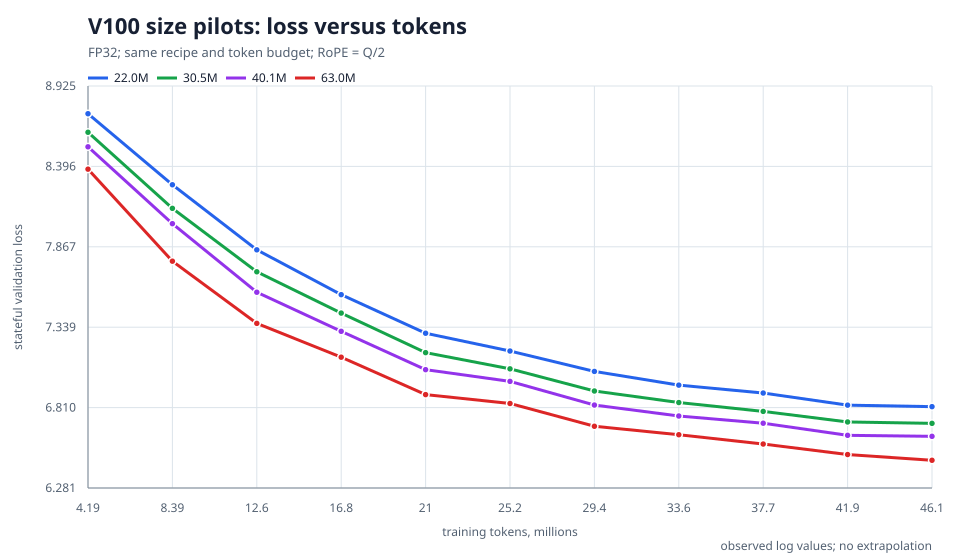
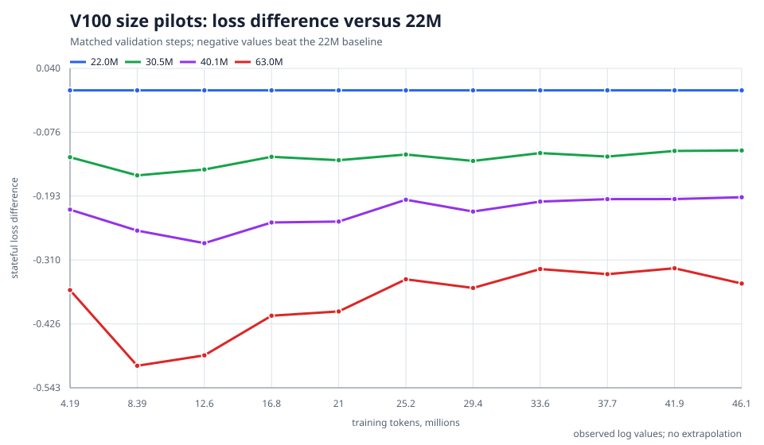
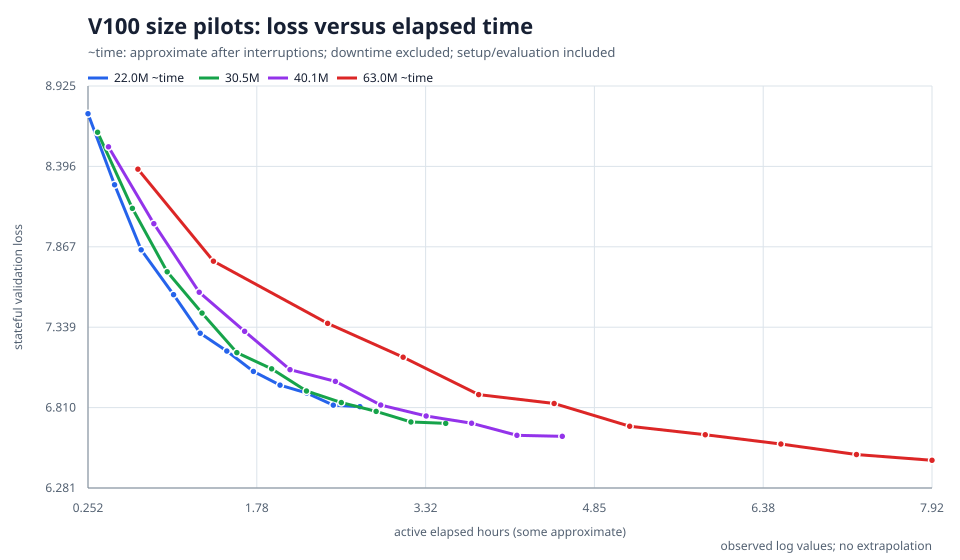

# V100 model-size pilot results

## Protocol and verification

These experiments evaluate our experimental v2 extensions, not published
BDH-CQ results. All four models completed 3,072 updates, or **50,331,648 tokens**.
Raw train.jsonl files and final checkpoint pointers were checked: step 3072,
192 training records and 11 validations per model, with finite recorded losses.
The last validation is at **step 2816, 46,137,344 tokens**, not the final
checkpoint: the trainer skips validation when it reaches --max-steps.

FP32 CUDA on V100; seed=42, vocabulary=24576, D=512/640/768/1024,
H=8, Q=1.5D, RoPE=Q/2, shared depth=8, MHAR=8. Delta wide-state,
per-neuron gates/retention and normalization are unchanged. TBPTT=2×256.
CQ reads/writes are fully enabled from the start; effective batch=64, physical
batch=8/8/8/4. Every model uses the same LR recipe: 10M-token warm-up,
max=3e-4 and the original full decay horizon. These are early training prefixes,
without size-specific LR tuning. Validation uses the same 384 single-lane
chunks (128 per source). Physical batch changes document grouping across lanes.

## Results

The table reports the last validation loss, also the best for every model.
Throughput is recomputed consistently as the median of the last 20 training
records, rather than different portions of attempt logs. Hours are the saved
total pilot times including overhead. `~` denotes approximate reconstruction
after interruptions; exact wall-time comparisons are unavailable for 22M/63M.

| Parameters | D | Batch | CQ loss | Memoryless loss | tok/s | Hours |
|---|---|---|---|---|---|---|
| 22.0M | 512 | 8 | 6.81592 | 6.89847 | 4970 | ~2.96 |
| 30.5M | 640 | 8 | 6.70617 | 6.79739 | 3792 | 3.81 |
| 40.1M | 768 | 8 | 6.62078 | 6.72141 | 2907 | 4.96 |
| 63.0M | 1024 | 4 | 6.46327 | 6.58329 | 1738 | ~8.59 |





| Parameters | FineWeb BPB | Ficbook BPB | Classic BPB |
|---|---|---|---|
| 22.0M | 1.3832 | 1.3763 | 1.4622 |
| 30.5M | 1.3573 | 1.3539 | 1.4427 |
| 40.1M | 1.3376 | 1.3342 | 1.4296 |
| 63.0M | 1.3072 | 1.3081 | 1.3883 |

## Time to a quality threshold



First **observed** stateful validation loss ≤ 7: the exact crossing between
evaluations is unknown. No interpolation is used.

| Parameters | Tokens, millions | Active hours |
|---|---|---|
| 22.0M | 33.55 | ~2.00 |
| 30.5M | 29.36 | 2.24 |
| 40.1M | 25.17 | 2.50 |
| 63.0M | 20.97 | ~3.80 |

## Conclusions and limitations

- At equal token counts, the larger model is better on all three sources.
  Relative to 22M, loss falls by 0.10975 / 0.19513 / 0.35264 nats for
  30.5/40.1/63M: approximately 10.4% / 17.7% / 29.7% lower perplexity.
- Larger models need fewer tokens to reach loss ≤ 7, but reach that threshold
  later on the observed time axis. Scaling parameters does not automatically
  improve time to quality on one V100.
- 63M has the best loss at a fixed token budget and the most expensive run.
  22M is useful for quick iterations; 30.5M is an intermediate compromise.
  These pilots do not establish a universal winner for final quality.
- Enabling CQ at evaluation reduces loss by 0.083/0.091/0.101/0.120 nats.
  This compares read-on/read-off in the same model, not separately trained
  memoryless models, and does not prove reliable long-context retrieval.
- One seed, a short budget and a shared LR cannot predict results at 1B tokens,
  compare optimally tuned sizes, or guarantee generation quality. Historical
  RX architecture/RoPE pilots used different TBPTT and CQ settings; their
  absolute losses are not a controlled measure of architectural regression.

## Recommendation for full training

For a quality-first run with the planned approximately 1.05B-token budget,
**choose 63M (D=1024, Q=1536, RoPE=768), FP32, batch=4, accumulation=16**,
provided roughly a week of V100 compute is acceptable. This is a practical
choice based on the best measured equal-token validation results, not proof
that the ranking will persist to the end of pretraining.

At 1,738 tok/s, 1.05B tokens take approximately 168 hours (7 days) of training
alone, plus validation/checkpoints and other overhead. This extrapolates the
observed rate; later data phases may have different throughput. The capacity
sweep measured about 23.9 GiB peak usage for 63M/B4, versus 30.6 GiB for
40M/B8. These are sampled benchmark peaks, not guaranteed long-run bounds.

If turnaround matters more, choose 40M: about 100 hours of training alone at
2,907 tok/s, but B8 leaves little VRAM headroom. No production config is changed
by this recommendation. The faster initial threshold crossing of 22M should
not be mistaken for evidence of better final quality at a fixed token budget.

## Reproducing the report and plotting a single run

```bash
python3 scripts/report_v100_pilots.py
python3 scripts/plot_loss.py runs/RUN_NAME/train.jsonl --x tokens --smooth 10 -o /tmp/loss.svg
python3 scripts/plot_loss.py /path/to/console.log -o /tmp/console-loss.svg
```

Plots are SVG and require only the Python standard library. plot_loss also
accepts a run directory and draws train/memoryless/stateful curves without
requiring completed training. It takes a snapshot; rerunning updates the SVG.
A truncated final JSON line is skipped with a warning; corruption in the
middle is an error. Only training loss is smoothed, over logged records rather
than optimizer steps. Use the steps axis for console logs missing token counts
at validation points. Backward step jumps indicate restarts: later old points
are discarded. Retain original logs; the plot cannot recover missing data.
