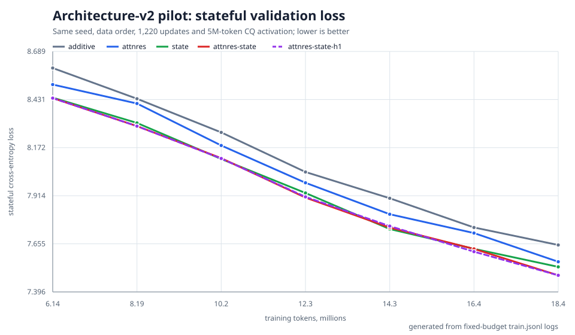
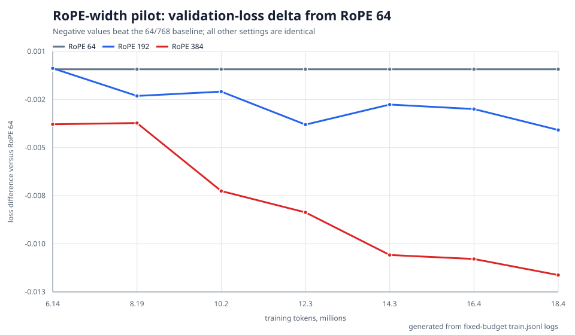

# Architecture-v2 pilot results

This report records the fixed-budget experiments used to freeze the v2
production architecture. It describes this repository's experimental
extensions, not published Pathway BDH-CQ results. The source logs remain under
`runs/rx6700-v2-delta-pilot-*` and `runs/rx6700-v2-rope-*`; the tables below can
be reproduced with the summary scripts, and the figures with
`scripts/plot_v2_pilot_results.py`.

## Experimental protocol

Every run used seed 42, the same packed corpus order, `D=512`, recurrent depth
8, 8 positive-feature heads, `Q=768` (`H*Q=6144`), local chunks of 256 tokens,
and the 24,576-token v2 vocabulary. Each run stopped after 1,220 optimizer
updates or 19,988,480 training tokens. CQ was enabled after 5M tokens so that
about 15M tokens exercised cross-chunk memory.

The reported held-out values come from the final stateful validation at step
1,125 (18,432,000 training tokens). `best-loss` equals `last-loss` for every
completed run, so none of the pilots had turned upward by its last validation.
Throughput is the median of the final 20 training log events. Lower loss and
bits per decoded UTF-8 byte (BPB) are better; `finite=True` means all recorded
training and validation losses were finite.

These are paired, one-seed, short-budget comparisons. They are enough to choose
the production candidate, but differences as small as the H=8 versus H=1 gap
must not be presented as a statistically established scaling result.

## Architecture ablation

All five variants retained tied embeddings, per-neuron CQ decay and
parameter-free per-depth normalization. The ablation changed only the narrow
depth residual and the presence of the redesigned wide delta-state.

| pilot | depth communication | wide delta-state | best stateful loss | FineWeb BPB | Ficbook BPB | Classic BPB | tok/s |
|---|---|---:|---:|---:|---:|---:|---:|
| additive | `X + Y` | no | 7.6488 | 1.581 | 1.525 | 1.630 | 3,712 |
| attnres | MHAR, 8 routing heads | no | 7.5586 | 1.556 | 1.513 | 1.611 | 3,533 |
| state | `X + Y` | yes | 7.5312 | 1.545 | 1.510 | 1.609 | 3,296 |
| **attnres-state** | **MHAR, 8 routing heads** | **yes** | **7.4856** | **1.537** | **1.505** | 1.593 | 3,176 |
| attnres-state-h1 | single-query AttnRes | yes | 7.4858 | 1.538 | 1.506 | **1.591** | 3,185 |



Against the additive control, MHAR alone reduced loss by 0.0902 nats (about
8.6% lower perplexity), while the wide delta-state alone reduced it by 0.1176
nats (about 11.1% lower perplexity). Combining them reduced loss by 0.1632 nats
or about 15.1% perplexity, with improvements on every corpus, at a 14.4%
throughput cost. The mechanisms therefore provide complementary gains at this
budget rather than merely duplicating one another.

The H=8 and H=1 combined variants differ by only 0.0002 loss and 9 tok/s. This
does not demonstrate that multi-head routing is better than single-query
routing. Production nevertheless retains H=8 because it has the same parameter
count, negligible measured overhead, slightly better aggregate and Ficbook
metrics, and preserves independent routing for different feature subspaces.
The routing-head choice remains experimental and should be revisited at a
larger model or training budget.

The five pilots took approximately 8 hours 15 minutes in total on the tested RX
6700-class GPU. The completed result selects `attnres-state` as the production
architecture.

## RoPE-width ablation

After fixing `attnres-state`, a separate sweep changed only the number of
rotated coordinates per 768-wide Q/K head. It did not change parameter count,
context length, corpus order, or training budget.

| RoPE/Q | best stateful loss | FineWeb BPB | Ficbook BPB | Classic BPB | tok/s |
|---:|---:|---:|---:|---:|---:|
| 64/768 | 7.4856 | 1.537 | 1.505 | 1.593 | 3,158 |
| 192/768 | 7.4819 | 1.536 | 1.505 | 1.593 | 3,131 |
| **384/768** | **7.4733** | **1.535** | **1.504** | **1.589** | 3,101 |



RoPE 384 beat RoPE 64 at every stateful validation checkpoint. At the final
checkpoint it improved loss by 0.0122 nats (about 1.2% lower perplexity) and
improved the rounded BPB on every corpus. Its throughput was 1.8% lower, a cost
of 57 tok/s, with unchanged model parameters and essentially unchanged peak
VRAM. RoPE 192 was consistently intermediate.

The sweep took approximately 5 hours 20 minutes. The production choice is
therefore `rotary_dim=384`: half of every Q/K head carries rotary position,
while the local exact context remains 256 tokens and CQ continues to provide
cross-chunk contextual memory.

## Frozen production decision

The selected v2 model is:

- `D=512`, depth 8, `H=8`, `Q=768`, `H*Q=6144`;
- redesigned per-neuron wide delta-state;
- MHAR with 8 routing heads;
- per-neuron CQ decay and per-depth narrow normalization;
- tied 24,576-token vocabulary projection;
- `rotary_dim=384` and 256-token local chunks;
- 22,043,648 learned parameters.

At the measured 3.1K tok/s, the 1,049,985,024-token production schedule is
expected to require about 94 hours of uninterrupted training. The pilot ranking
is not a promise about final model quality: production monitoring must continue
to compare memoryless/stateful validation and per-source BPB throughout the
run.

## Reproducing the report

```console
python3 scripts/summarize_v2_pilots.py
python3 scripts/summarize_v2_rope_sweep.py
python3 scripts/plot_v2_pilot_results.py
```

The plotting command uses only the Python standard library and deterministically
regenerates both SVG files from the JSONL logs.
